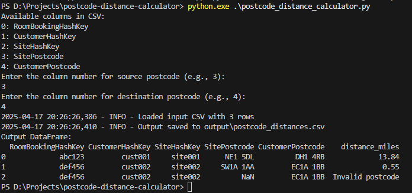

# Postcode Distance Calculator

A Python app to calculate distances between UK postcodes using pgeocode, reading from a CSV and saving results with distances.

## Features
- Calculate distances between postcodes from a CSV input.
- User-specified source and destination postcode columns.
- Output DataFrame with distance_miles column saved to CSV.

## Technologies
- Python: Pandas, pgeocode
- Data Source: Public postcode data (e.g., Postcodes.io)

## Setup
1. Clone: `git clone https://github.com/your-username/postcode-distance-calculator.git`
2. Install: `pip install -r requirements.txt`
3. Add input CSV to `input/postcodes.csv`.
4. Run: `python postcode_distance_calculator.py` and enter column names.

## Usage
- Input CSV format: Columns with source and destination postcodes (e.g., SitePostcode, CustomerPostcode).
- Output: CSV in `output/` with added `distance_miles` column.

## Demo

## License
MIT License